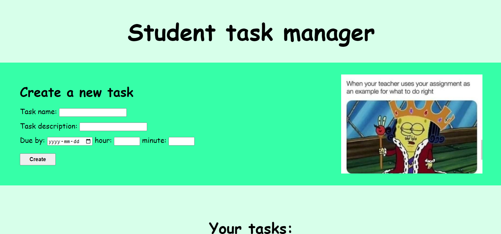
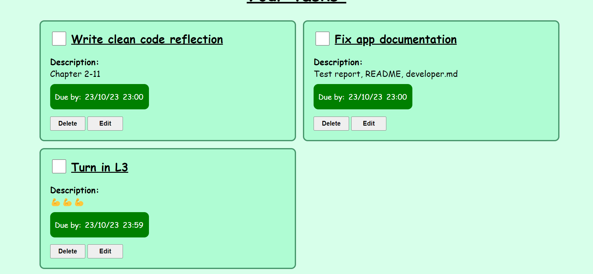

# Student task manager
## Project vision

**Background**  
Every student knows the struggle of having deadlines or exams due, but having a good planner can certainly help make things less stressful. This task manager will help students keep track of their to-do’s and deadlines, with an easy to use interface and fun design to help keep motivation high.

**Target audience**  
Students who want to organize and keep track of their studies and deadlines.

**Features**  
- Create tasks with a name, short description and a date and time for when it should be complete
- Tick off completed tasks
- Edit the task information
- Delete tasks you no longer wish to see
- Fun student memes

**Techniques**
- Javascript, html & css
- Deployed on Nelify
- Using the [time-date-manager](https://www.npmjs.com/package/time-date-manager) module to get the date and time formats

## Website images

## For developers
Find more information for developers who want to work with the code [here](developer.md)
